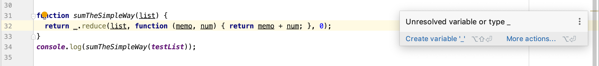

Back to the time when I first learned Java, the check style almost drives me crazy. I often complained about it with my friends that the checking of code style is useless. However, after using it couple years, I realized that the checking of code style is very useful for my coding. Therefore, after my first week of using ESlint with IntelliJ, I find that it is painful but it is also very useful for me to learning coding with Javascript.

## Complain about ESlint
  

  Writing code is difficult and ESlint make it become more challenging. The first assignment I wrote with IntelliJ is that write four functions to sum the numbers in the list and one of them need use underscore which is a Javascript library. After I finishing my code, ESlint keep showing that there is a weak warning of my underscore symbol. I tried so many different ways to solve it but none of them works. With the help  of my teacher, I finally found the problem which is that I did not turn on the underscore library. It took a lot of my time. In order to get the little green checkmark, I need spent more time on my coding. However, more time I spent on the code style, more knowledge I learned.
  
## Advantage of ESlint
  
  After practice ESlint for a whole week, my skill on code style is improved a lot. The first time of practice with IntelliJ, it took me almost 30 minutes to solve the problem because of solving code style. After practice couple times, I only need 12 minutes to solve it. As I get more and more skilled on the code style solving,  the second assignment only took me 15 minutes at my first try which is already faster than the average speed.
  
  There is another advantage of practice ESlint, which is it can help us learning a language better. Although different coding languages may have many differences, the coding standards required will be similar to each other. Some language even take it as a very serious task. For example, Python is a language that treat indent as a very important element. If you make mistake on the indent, the whole program may run to a wrong answer. In my conclusion, learning coding standards is very important for our computer science students. In spite of learning it is so much painful, but the outcome will make us appreciate with it.
