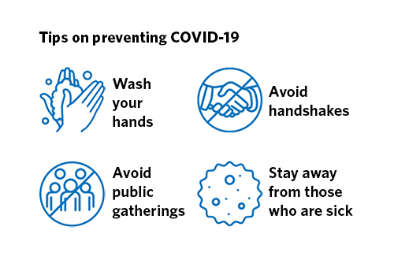

<h1>Social Distancing</h1>

As the outbreak of the new coronavirus worldwide, the life of all humans is changing. Till today, the total cases of COVID-19 in the U.S. is 163,539 and 2860 death because of it. There is no doubt that this is an extremely serious situation. Fortunately, there is something we can do to help which is staying at home. Social distancing can protect not only themselves but also protect others from diseases. 

I have stayed home for three weeks and not even step out once. This is a totally different lifestyle. In the past, when I was free, I would call my friends and ask them to hang out. But right now, the farthest place I can go is my balcony. As a student, studying at home affects my learning a lot. All the courses become online courses which creates a little bit of the challenge of learning. The advantage of a face to face class is that professor can supervise us and give more help to students. And when all the classes become online teaching, those advantages lost and will bring some disadvantages for us. There are too many things will distract me at home, television, video game and so on. I have nearly lost time concept because every day is the same so I may think it still has time to do my homework and I can have fun with the game first.

The other great impact is on my finances. As the outbreak of the virus, I lose my part-time job as well. So I have no income right now but there are many financial expenditures like rent and food. Fortunately, I have some money on my bank but it will wipe out if the situation lasts longer. Of course, comparing health, finances issue is not a big deal. As long as we are safe, everything we have done is worth it.

The experience of social distancing changes some of my values. The first thing I realized is nothing is more valuable than health. The other value is to value highly our time, no one knows what will come tomorrow so it is very important to live every day as the last day, then our life will be much more meaningful. 

Social distancing has changed my life, but it is very important for us right now. It is a way for us, common people to fight against the virus. Therefore, for the people you love, for yourself, please stay at home!
