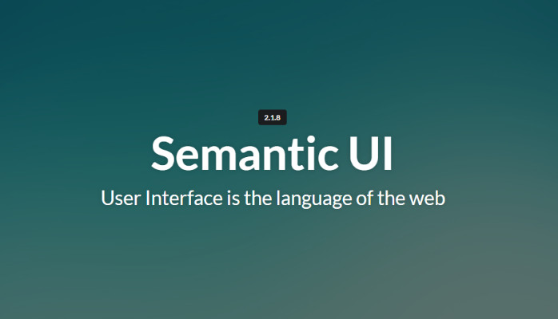
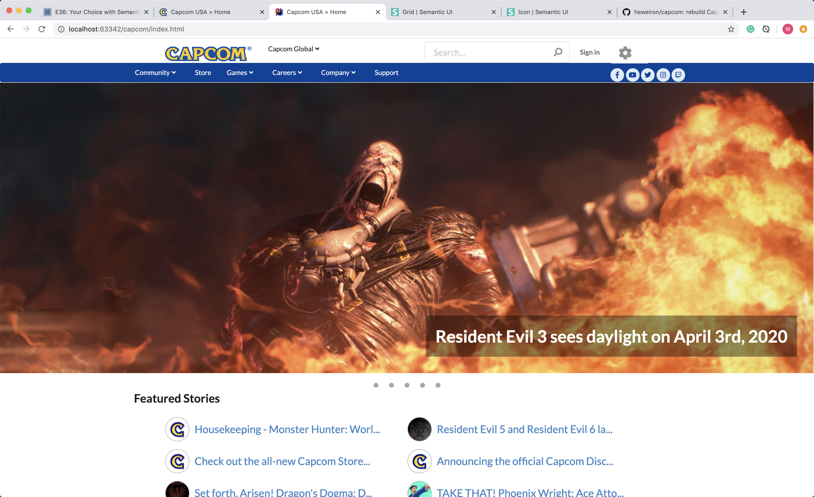

It says that practice makes perfect. After this week’s learning, I truly get how important practice is. Building UI Frameworks is a complex and hard task that may take plenty of time on adjusting UI. It is not easy for me to make my website exactly match my thoughts. I have to think and try again and again. Fortunately, the experience gave me a lot of benefits to my coding skills.

<h2>Experience on UI Frameworks</h2>

Using raw HTML and CSS to build a website is a hell level challenge for me right now. In order to make everything look nicer, I have to write tons of lines to implement a single element. In one of my assignments, I was asked to make three paragraphs displayed as three columns. So I have to set their float, size, padding and so on in the CSS and I think things are going to become worse if I am asked to display four columns.

	
  
Comparing using raw HTML and CSS, using Semantic UI makes my life much easier but still hard. Using Semantic UI can make my code nicer and cleaner. I can easily set some style of my object by adding an adjective in the class name. However, there are many details that semantic UI cannot achieve. In this case, I have to adjust them with additional CSS which makes the task become more challenging. The first assignment I did with Semantic UI is modifying a website called Island Snow. In the first attempt, I spent 38 minutes which is way beyond the standard time, and I even not quite finished because it still had an issue that needed to be fixed. After many times of practice, I finally am able to finish it in 23 minutes.

  <h2>My Outcome</h2>
  
  
I also did an assignment that asks me to practice Semantic UI on the site of my choosing. It is hard because there is no more instruction and hints for this task. My choosing site is Capcom and it contains many complex elements. Although I can choose to implement only a subset of this complex page, I still tried my best to build the whole page as much as I can. The result is exciting because I successfully implement the whole UI framework of that page and I did extra work to make all the buttons actually functioned.

  
I think this week’s learning on UI frameworks helps me a lot with my coding skills. What UI frameworks taught me is the structure of my code is very important because if I found mistakes I made I can easily fix it without searching over and over to see what goes wrong. I think I am skillful to use Semantic UI right now because I did plenty of practice on it. At the beginning of this week, I thought this concept will be very hard but as I spent more time on it, I can conquer it in the end.

