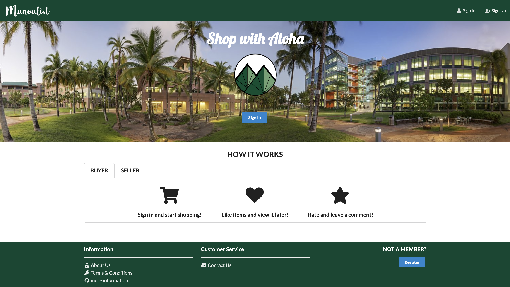
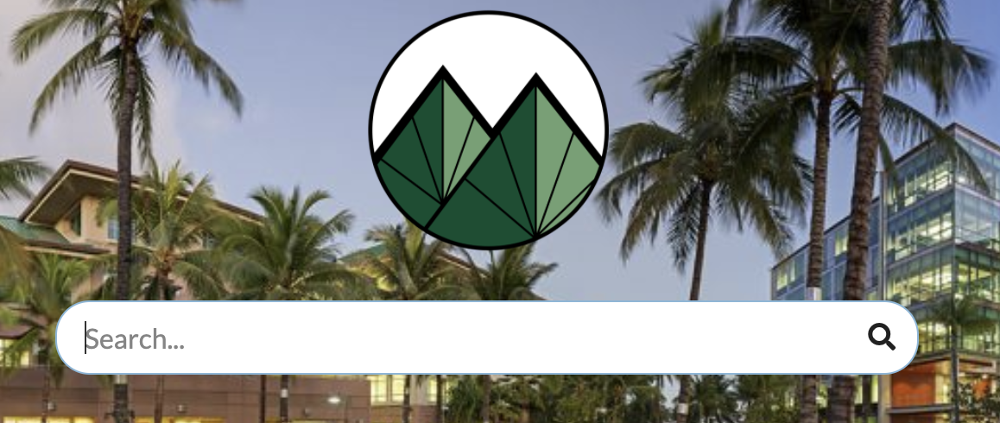
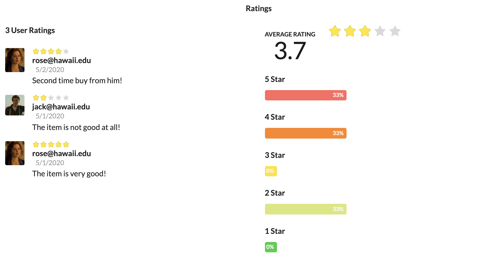

  

## Project Overview

Manoalist is an application for UHM students to facilitate buying and selling of student-related goods. Students can
 and only can register with their UH email. After login, they can play two roles: Buyer and Seller.
 
### For Seller:

   - If users have items that they want to sell, they can click Sell button and post the information of
   item. 
   - Sellers can reply email from buyers who contact them. 
   - After making the deal with buyers in person, Sellers can click sold button in their item detail page to close
    the deal.
   - Sellers can write a review for their item's buyer after close deal.
 
### For Buyer:

   - Buyers can browse the store to see the items for sell.
   - If they see some items is not appropriate, they can click report button to send report information to the
    Administrator.
   - Buyers can contact seller from Item detail page.
   - After close the deal, buyers can rate the seller and leave a comment. 
   
   
## My Contribution

In this project, my job is focus on UI design. I did the UserHome page, ListItem page, EditItem page, EditProfile
 page, AdminHome page and all the functionality of these pages.
  
  some of functionality that I am proud with are 
  - I have also created the internal email system so that
  Users can contact with sellers or buyers with our email system. 
  - Search and Category functionality to show items list
  
   
   
  - Rating system which allows users to rate others.
  
   
  
## My Gain

  From this project, I learned how to work with others to finish a team project. I also enhanced my skill of using
   semantic UI React and Javascript and learned how to deploy a website. This project is also my first real completed
    application so it also gave
    me a
    lot of confidence on my future programming. This is a great opportunity for me to practice and examine what I have
     learned so far.
  
  
Here is the address of our project github repository https://github.com/manoalist/manoalist
  
Project Page: <a href="https://manoalist.github.io/">manoalist</a>

Source : <a href="https://github.com/manoalist/manoalist"><i class="large github icon "></i>manoalist</a>
