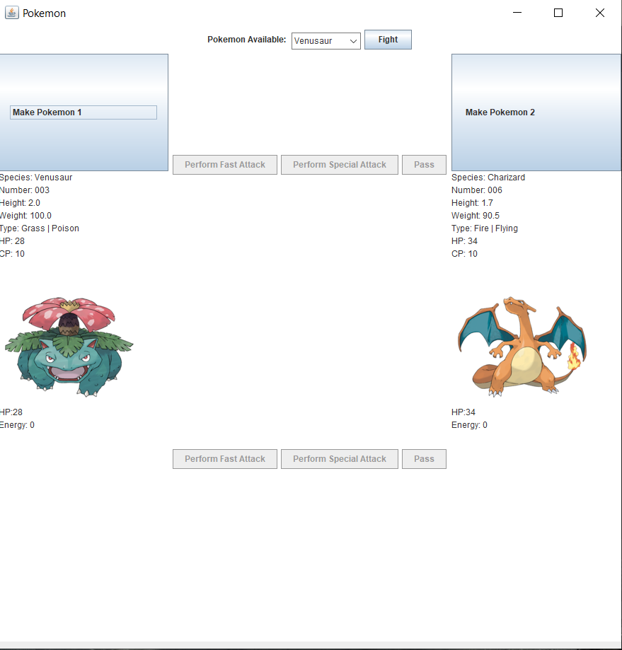

  

It is a interactive game with Pokemon battle simulation. Two players will alternate turns on the same computer.

I developed this game based on the assignment data of ICS211. The original assignment is to build a word game that will display sentence and ask user to type input to run the game. I developed it to a GUI and add some picture to let it looks nicer.

This is my first game project and it teach me the basic knowledge of developing a game.

Playing Guide: 
  First, choose your Pokemon from top menu [Pokemon Avaliable], then click [Make Pokemon 1] or [Make Pokemon 2] button to creat a new      Pokemon. Pokemon will have ramdom CP and HP based on Pokemon's species.
  Sencond, click [Fight] button, the program will  ramdomly choose one of the player to start first.
  Player can choose from [Perform Fast Attack], [Perform Special Attack] and [Pass].
  [Pass] can store energy which is for special attack.
  [Perform Special Attack] can let Pokemon use more powerful attack but it needs Pokemon to store 3 energy to perform.
  [Perform Fast Attack] can let Pokemon use basic attack.
  Once a player's Pokemon has fainted, the game end. User can choose a new Pokemon to have another battle.
  
  
Here is the address of my github repository https://github.com/heweiron/PokemonFightSystem
download all the files and the main method is PokemonFightFrame.java.
  
Source : <a href="https://github.com/heweiron/PokemonFightSystem"><i class="large github icon "></i>heweiron/PokemonFightSystem</a>
