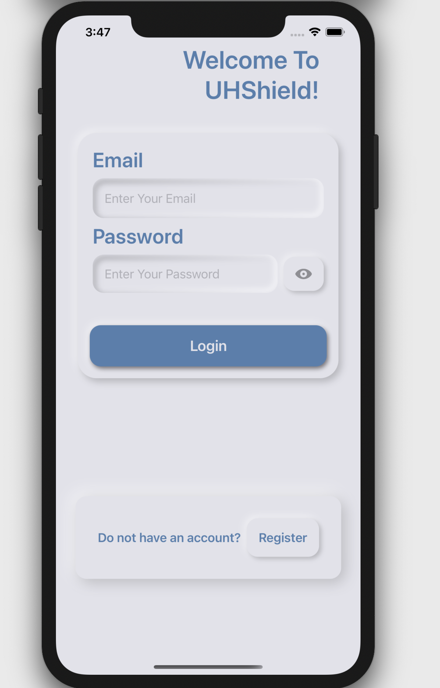
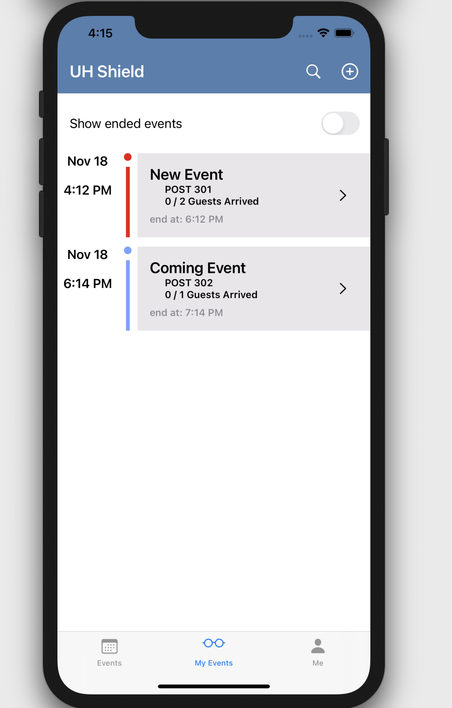
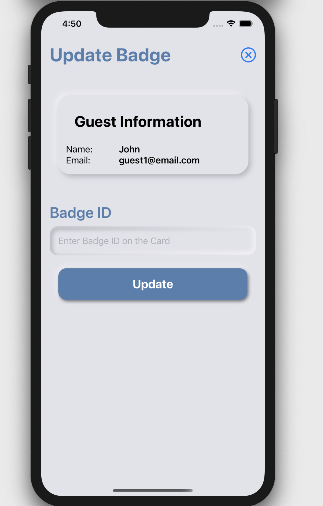
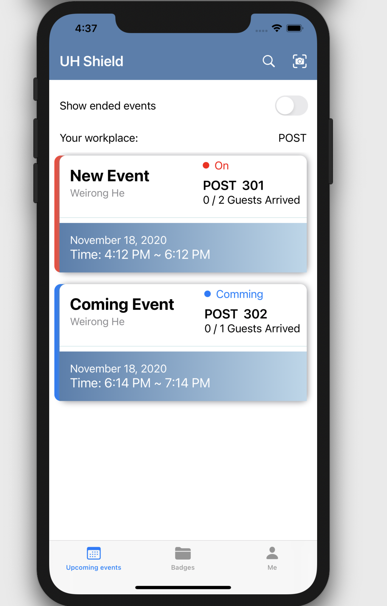

## HACC 2020
<a href="https://hacc.hawaii.gov/">Hawaii Annual Code Challenge</a> is a hackathon that encouraged civic engagement with the local technology community in modernizing state functions and services for a more effective, efficient and open government. Participants can form a team and select one of the challenges from the list and provide their unique solution for it. This year, I attended HACC 2020 and won <i class="yellow star icon"></i>THIRD PLACE with this project.

  

## Project Overview

Some UH buildings required significant access control, and the building security of unknown vistor become a very big problem. UH staffs had to share a spreedsheet to record all the guest and manually review the sheet for all guest and physically monitor those suspicious visitors. To provide more convienence to UH staffs, we building this mobile APP called UHShield. UHShield is a powerful APP that can easily setup new event and invite guest to come to the building and efficiently check with guest identity and provide security to the building.

 
### For Sponsor:

   - Sponsors can use our APP to create new event and then send invitation email with QR-Code to their guests.
   - UHShield will automaticly check place or time conflict before creating event
   - Sponsors can also easily manage their own events: edit or delete. 
   - When guests showed up, sponsor can use our APP to take attendance of checked in guests.
   - Sponsors can browse all the events in the campus and use search function to quick look up for a certain event.
 
### For Reception:

   - Receptionists are assigned to a certain building which is their workplace.
   - They just need scan the QR-Code provided by guest to make check in.
   - If guest don't have QR-Code, receptionists can also use event list of the day or search function to make check in.
   - After successfully checked in, receptionists should assigned a physical badge to each guest and using our APP to record badge.
   - Receptionists also need to recycle badges from guest and delete badge information as check out.
   
   
## My Contribution

In this project, my job is focus on UI design and some core functionality. I designed sign in, sign up views, event row UI, and sponsor manage events view UI. In addition, I made the video above which presenting APP functionality.

  
  
  
  

  
   What's more, I also make contribution on some important functionalities, which are 
  - Implementing a QR-Code generator for each guest
  - Building send email functionality inside the APP which can help send QR-Code to invited guests.
   
  - Scanning QR-Code to check in functionality.
  
  
## My Gain

  From this project, I learned how to work with others to finish a team project. My teammates Tianhui Zhou, Yuhan Jiang and I form a team called Trigeeks. We could not won the price without their help. As a team, we worked together and each of us on charge different area. My mainly focus part is UI design. Therefore, I tried so hard to come up different versions of UI and choose the best one. We only get couple weeks to finish this project but the fact is that we did a great job on it with this short period and we won the 3rd place. I will say we deserve it and our effort does not waste.
  
  In addition, I also enhanced my skill of using Xcode and code with SwiftUI. To be honest, I just started learning how to build a APP this year. I think attending HACC2020 is a great opportunity to exam what I have learned, and I feel I am comfortable with coding with Swift. It is a powerful language and building an actual running APP from it gave me plenty gratification.
  
  This project is also my first experience on attending a competition like event. We not only need to write code, but also need to present our product in front of hundreds of people which includes many respectable professors and even governor David Ige. The presentation made us nervous but we came over it! I produced the demo video (first time as well), and pratice a lot before the review day. And guess what, we did a extremely great job.
  
  In conclusion, I will say attending HACC 2020 and making this project UHShield is a great experience in my life. I paid a lot to it and learned a lot from it.
  
  
  Here is the link to the project app devpost page and github repository.
  
Devpost Page: <a href="https://devpost.com/software/uhshield">UHShield</a>

Github Repo Source : <a href="https://github.com/HACC2020/Trigeeks"><i class="large github icon "></i>UHShield</a>
  
