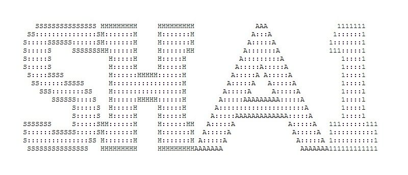

In cryptography, SHA-1 (Secure Hash Algorithm 1) is a cryptographic hash function which takes an input and produces a 160-bit (20-byte) hash value known as a message digest – typically rendered as a hexadecimal number, 40 digits long. It was designed by the United States National Security Agency, and is a U.S. Federal Information Processing Standard.
My algorithm can convert a txt file into a sequence of message digest with letter and number.The detail is in the pdf file named "FIPS180-1-SecureHashStandard.pdf" in my github repository: https://github.com/heweiron/SHA1

Source: <a href="https://github.com/heweiron/SHA1"><i class="large github icon"></i>heweiron/SHA1</a>
