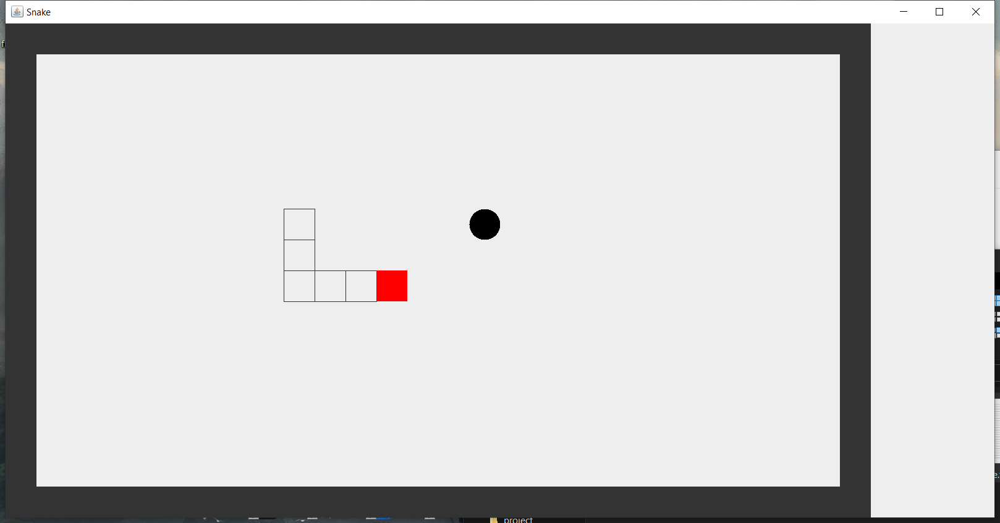

Snake is the common name for a video game concept where the player maneuvers a line which grows in length, with the line itself being a primary obstacle. The player controls a square on a bordered plane. As it moves forward, it leaves a trail behind, resembling a moving snake. The snake continually gets longer as it moves. The player loses when the snake runs into the screen border, a trail or itself.

* The game will let user choose a hard level which decide the speed of snake's moving. 
* User can use direction key from their keybord to control the moving direction of snake. 
* [space] button can make game pause. 

There is still issue that the screen will blink which need to be solved.

Here is my git hub repository of Snake, the program consists three file: {CarFrame.java  CarPanel.java  Snake.java}. The main method is inside CarFrame.java.

I build this game all by myself. However, there is still some issue inside the code and I hope as I learning more about programming, i will fix this issue in the future.

This game is the first game that I develop all by myself. It trained me the ability to design the UI, to test the game and to write a complicate code.

Source: <a href="https://github.com/heweiron/Snake"><i class="large github icon"></i>heweiron/Snake</a>
